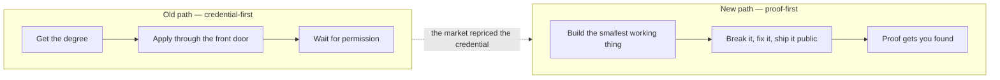
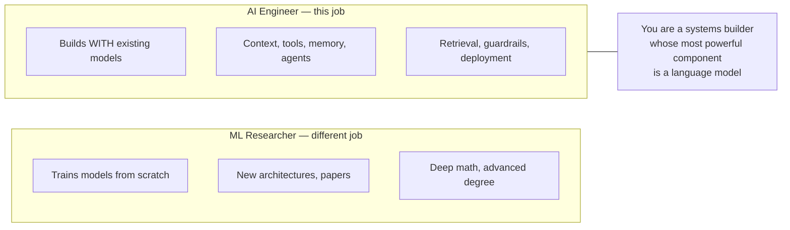
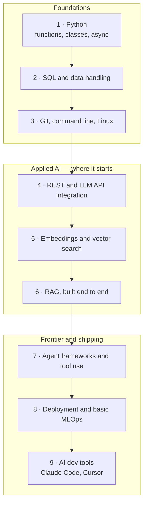
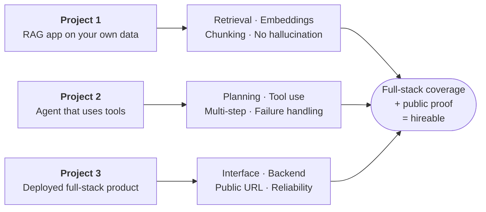
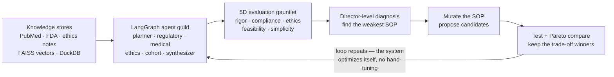
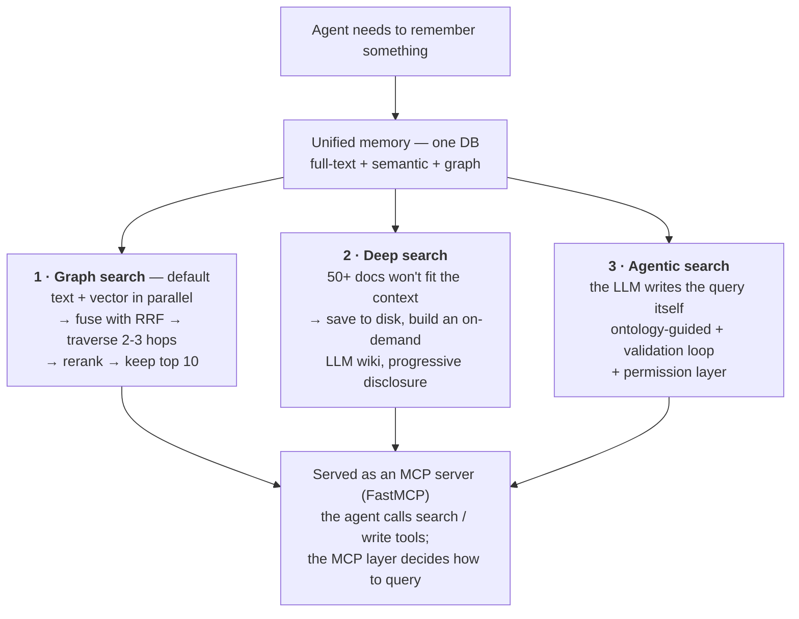
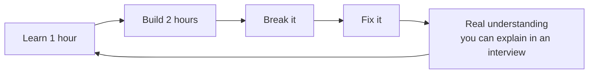
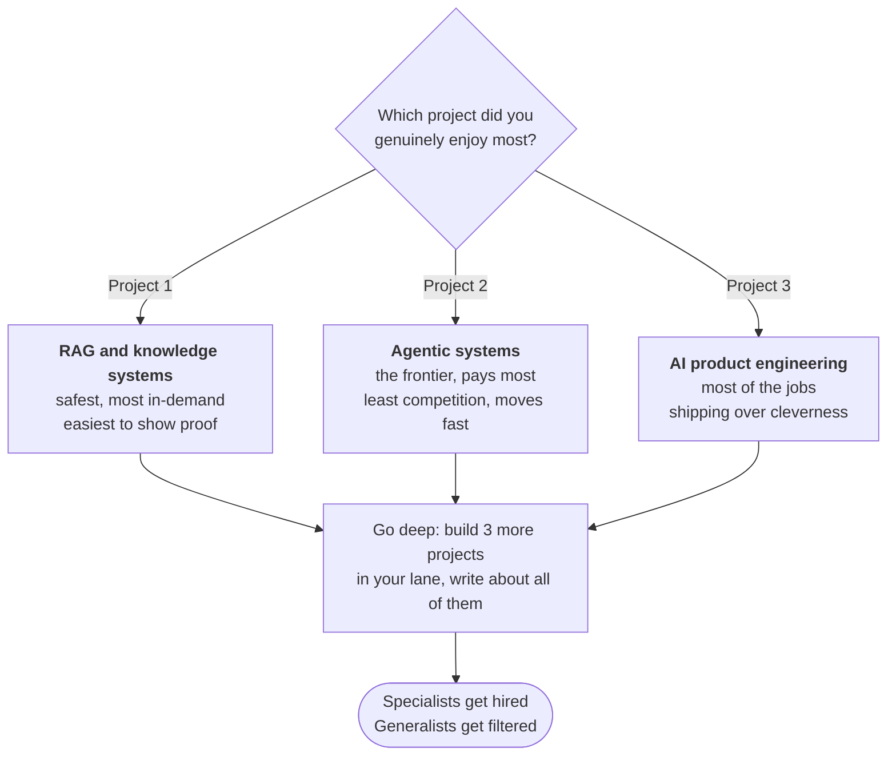
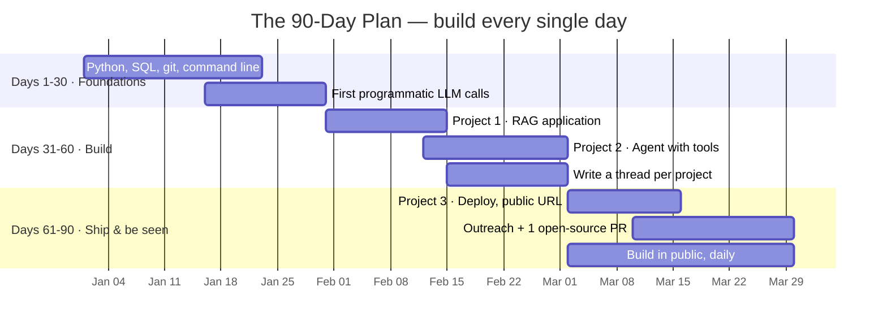
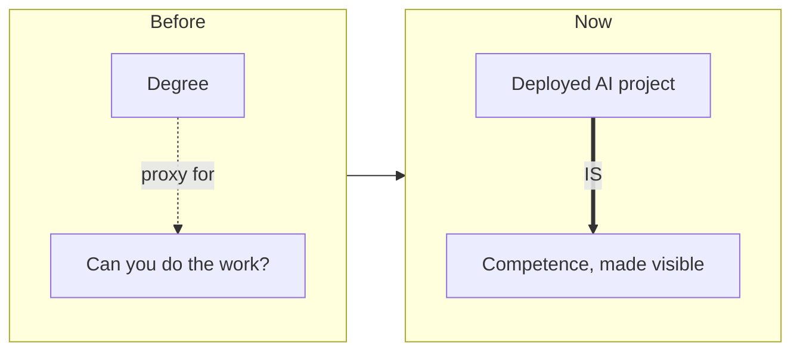

# How To Become An AI Engineer in 2026 (Without a CS Degree) — Full Course

> **The CS degree is optional now. The skills are not.**

*A no-fluff field guide to building the proof that actually gets you hired — a real stack, in order, with the exact projects and the exact way to learn each piece using the tools already sitting on your laptop.*

---

## Contents

- [Why the old path is broken](#why-the-old-path-is-broken)
- [What an AI engineer actually is in 2026](#what-an-ai-engineer-actually-is-in-2026)
- [The stack, in order](#the-stack-in-order)
- [The 3 projects that actually get you hired](#the-3-projects-that-actually-get-you-hired)
- [How to actually learn each piece](#how-to-actually-learn-each-piece)
- [How to get hired without the degree](#how-to-get-hired-without-the-degree)
- [Picking a specialization](#picking-a-specialization-once-the-basics-click)
- [What the first 6 months actually look like](#what-the-first-6-months-on-the-job-actually-look-like)
- [The mistakes that stall people](#the-mistakes-that-stall-people)
- [Your 90-day plan](#your-90-day-plan)
- [The real reason this works now](#the-real-reason-this-works-now)
- [Deep dives](#deep-dives)

---

That sentence at the top is going to make a lot of people angry, and most of them will be people who spent four years and a lot of money on a credential that the market is quietly repricing. I understand the anger. It does not change the reality. In 2026, companies hiring for AI engineering roles are looking at what you can build, not where you sat for lectures.

I am not saying a CS degree is worthless. If you have one, it helps. What I am saying is that the degree stopped being the gate. The gate now is **proof**. Can you build something that works, explain why it works, and ship it where someone can actually see it. That is the whole test.

This is the complete path to passing that test without a degree. No motivational fluff, no "just believe in yourself." A real stack, in order, with the exact projects that get you hired and the exact way to learn each piece using the tools already sitting on your laptop.

---

## Why The Old Path Is Broken

The traditional path told you to get the degree, apply through the front door, and wait for permission. That path assumed the credential was the scarce thing. It is not anymore.



Here is what actually happened. AI tools collapsed the distance between knowing a concept and building with it. Ten years ago, turning an idea into working software required years of accumulated syntax knowledge. Now the syntax is the cheap part. The scarce part is knowing **WHAT** to build, **HOW** to structure it, and **WHY** one approach beats another. Those are judgment skills, and judgment does not come from a diploma. It comes from building things, breaking them, and building them again.

So the people getting hired right now are not the ones with the most impressive transcript. They are the ones with a public trail of things they built. A GitHub full of real projects. A demo someone can click. A thread explaining how they solved a hard problem. That trail is worth more than a degree because it proves the exact thing an employer actually needs to know, which is whether you can do the work.

The mistake most people make is spending months preparing to be ready instead of building the trail. They take one more course, watch one more tutorial, wait until they feel qualified. That feeling never arrives. You do not become an AI engineer by finishing a curriculum. You become one by building AI systems, badly at first, then less badly, until the things you build actually work.

---

## What An AI Engineer Actually Is In 2026

Before the stack, get the definition right, because most people are aiming at the wrong target.

An AI engineer is **not** a machine learning researcher. You are not training foundation models from scratch or publishing papers on new architectures. That is a different job, and it does require deep math and usually an advanced degree.

An AI engineer **builds with models that already exist.** You take Claude, GPT, or open models and you wire them into systems that do useful work. You connect them to data. You give them tools. You build the retrieval, the memory, the agent loops, and the guardrails that turn a raw model into a product. You are a systems builder whose most powerful component happens to be a language model.



That distinction matters because it tells you what to actually learn. You do not need to understand backpropagation to be excellent at this job. You need to understand how to feed a model the right context, how to structure a multi-step task so it does not fall apart, how to verify output, and how to deploy the whole thing so it runs reliably. Those are engineering skills, and every one of them is learnable without a degree.

---

## The Stack, In Order

Learn these in sequence. Each one builds on the last. **Skipping ahead is the most common way people stall out**, because they try to build agents before they can handle data and then wonder why nothing works.



1. **Python.** Functions, classes, async. You do not need to be a Python wizard. You need to be fluent enough to read code, write scripts, and understand what an AI coding assistant produces for you. Async matters specifically because most AI work involves waiting on API calls, and blocking code will bottleneck everything you build.
2. **SQL and data handling.** Almost every real AI application touches data. You need to pull it, clean it, and shape it. SQL is the universal language for this and it has barely changed in decades, which means it is a safe, permanent skill to own.
3. **Git, command line, and Linux basics.** This is the environment every serious tool lives in. Claude Code runs in the terminal. Deployment happens on Linux servers. Version control is how you avoid losing work and how you collaborate. Nobody hires an AI engineer who cannot use a terminal.
4. **REST APIs and LLM API integration.** This is where AI engineering actually starts. You learn how to call a model programmatically, handle its responses, manage rate limits, and handle errors. Every AI product is fundamentally a series of well-structured API calls.
5. **Embeddings and vector search.** This is how machines understand meaning instead of just matching keywords. You convert text into vectors, store them, and search by similarity. This is the foundation of every retrieval system and the concept most beginners skip and later regret skipping.
6. **RAG, built end to end.** Retrieval Augmented Generation. You give a model access to your own documents so it answers from real information instead of guessing. This is the single most in-demand skill in applied AI right now because almost every company wants a system that can answer questions about their own data.
7. **Agent frameworks and tool use.** You move from a model that answers to a model that acts. It calls tools, executes multi-step tasks, and does real work. This is the frontier, and being competent here separates you from the crowd still writing single prompts.
8. **Deployment and basic MLOps.** A project that only runs on your laptop is a hobby. You need to know how to get it running somewhere real, monitored, and reliable. This is the difference between "I built a demo" and "I shipped a product."
9. **AI dev tools.** Claude Code, Cursor, and the agentic tooling that makes you dramatically faster. Mastering these is not cheating. It is the actual job. An AI engineer who cannot use AI to build faster is like a carpenter who refuses power tools.

---

## The 3 Projects That Actually Get You Hired

Nobody hires you for finishing courses. They hire you for proof. Build these three and you have proof that covers the entire stack.



**Project 1. A RAG application using your own data.**
Take a real body of documents. Your notes, a set of PDFs, a company's public docs, anything. Build a system that ingests them, embeds them, stores the vectors, and answers questions grounded only in that data. This single project proves retrieval, embeddings, chunking, and the ability to prevent hallucination. It is the most directly hireable thing you can build because it is exactly what companies want.

**Project 2. An AI agent that uses tools.**
Build an agent that does not just answer but acts. It calls at least two real tools — a search API, a calculator, a file writer, a calendar. It plans, executes, and handles the case where a tool fails. This proves you understand agent design, not just prompting, which is the skill most beginners never actually demonstrate.

**Project 3. A deployed, full-stack AI product.**
Take one of the above and ship it. A real interface, a backend, deployed somewhere with a public URL a stranger can visit and use. This proves the thing employers worry about most, that you can ship past "works on my machine." **A deployed project is worth ten local ones on a resume.**

Three projects. Full-stack coverage. Public proof. That portfolio beats most degrees for this specific job.

---

## Go Deeper: Real Systems Worth Studying

The fastest way to level up after your first three projects is to read real, advanced, open code and understand *every line* — that is the whole skill this course is built around. Two systems worth studying:

### 1 · Self-improving agentic RAG

Want to see Projects 1 and 2 taken all the way to the frontier? Study [`autonomous-agentic-rag`](https://github.com/FareedKhan-dev/autonomous-agentic-rag) — an open-source (MIT), code-backed, notebook-style walkthrough of a **self-improving agentic RAG pipeline** for healthcare trial design (built by [Fareed Khan](https://github.com/FareedKhan-dev); surfaced by [@DanKornas](https://x.com/DanKornas)). It is exactly the "wire real systems together and let them optimize themselves" work this course points at — the frontier lane, made concrete.



What it wires into one project:

- **Multi-source RAG base** — PubMed abstracts, FDA guidance, ethics notes, FAISS vector stores, and DuckDB for structured clinical data.
- **LangGraph agent guild** — planner, regulatory, medical, ethics, cohort-analyst, and synthesizer roles sharing one workflow state.
- **Local model routing** — Ollama-served models assigned per role (planner, drafter, SQL coder, director, embeddings).
- **5D evaluation gauntlet** — scores every output on rigor, compliance, ethics, recruitment feasibility, and operational simplicity.
- **Evolution + Pareto loop** — diagnoses weak SOPs, proposes mutations, tests candidates, and compares the trade-offs.

Do **not** try to build this on day one. Build the simple RAG (Project 1) and the two-tool agent (Project 2) first — then come back and read this to see where the road goes: **retrieval + agents + evals + self-improvement, all in one project.** Stop hand-tuning agentic RAG in the dark — study a system that tunes itself, then build your own small version.

### 2 · Agent memory and GraphRAG retrieval

Once your agents do real work, they need **memory** — and the hard part is not storage, it is **retrieval**. Paul Iusztin ([@pauliusztin_](https://x.com/pauliusztin_)), writing a Manning book on building a personal assistant from scratch, shares a battle-tested pattern worth internalizing: *"Building memory for AI agents is less about storage and more about retrieval."*

His setup stores the entire knowledge graph in a **single database** (e.g. MongoDB) that handles full-text search, semantic (vector) search, and graph traversal in one place. You lose a graph-native query language; in exchange you get radical simplicity — a trade he'd make every time for a personal assistant. On top of that unified memory, the agent gets **three ways to search**:



The insight to steal: **GraphRAG isn't just vector search plus a graph — it's multi-hop traversal during retrieval.** Similarity finds the *entry point*; the graph finds everything *connected* to it.

Two more principles from that thread that will save you real pain:

- **Serve memory through an MCP layer, not the raw database.** A harness like Claude Code calls tools; the MCP layer owns *how* memory is queried. The agent never touches the DB directly — which is also a clean tie-in to stack item 7 (agents and tool use) and item 9 (AI dev tools).
- **"Orchestrate the writes. Never the reads."** Ingestion runs as durable async workflows (he uses [Prefect](https://www.prefect.io/)) with retries, caching, checkpointing, and centralized rate limiting — so a failed extraction never blocks the graph from staying searchable, and the read path never waits on orchestration.

Together these two systems map the whole upper half of the stack: **embeddings → RAG → agents → evals → memory → self-improvement.** Study them, then build the smallest version you can explain.

---

## How To Actually Learn Each Piece

Here is the part most guides skip. You do not need to buy a $500 course to learn any of this. You have the best tutor ever built sitting on your laptop. **Use the model to teach you the skills you will use to build with the model.**



Use this prompt to turn Claude into a structured tutor for any skill in the stack:

```text
You are my coding tutor for [SKILL, e.g. embeddings and vector search].
I am learning to become an AI engineer and I have no CS degree.
Teach me this in a build-first way, not theory-first.

1. Explain the core concept in plain language with one concrete analogy.
2. Give me the smallest possible working code example I can run today.
3. Give me one slightly harder exercise to do on my own.
4. After I share my attempt, critique it and point out what a senior
   engineer would do differently.

Assume I learn by building and breaking things, not by reading.
Wait for me to complete each step before moving to the next.
```

That single prompt replaces most paid courses. It adapts to your level, answers your exact questions, and never moves on until you actually understand.

For the projects, use Claude Code to scaffold and then **force yourself to understand every line.** Do not copy blindly. After it generates code, run this:

```text
Walk me through the code you just wrote line by line.
For each section, explain what it does and why you chose this approach
over the obvious alternative. Then point out the one part most likely
to break in production and how I would fix it.
```

This is how you build real understanding instead of a pile of code you cannot explain in an interview. The people who fail interviews are the ones who built projects they cannot actually explain. Do not be that person.

---

## How To Get Hired Without The Degree

The portfolio is necessary but not sufficient. You also have to be **visible**, because nobody hires proof they cannot find.

**Build in public.** Every project you build, write about. A thread on what you built, the hard part, how you solved it. This does two things. It creates a public trail that shows up when someone searches your name, and it forces you to understand your own work well enough to explain it. Employers increasingly find engineers through their public building, not through job boards.

**Contribute to open source.** Find an AI project you use and fix something. A bug, a doc improvement, a small feature. A merged pull request to a real project is a credential no degree can give you. It proves you can work in someone else's codebase, which is most of the actual job.

**Reach out directly with proof, not requests.** Do not send "I am looking for opportunities." Send "I built this thing that solves the exact problem your product has, here is the demo." Attach the proof. This converts because it demonstrates the skill in the act of asking for the job.

Here is a template for that outreach:

```text
Subject: Built a [thing] that solves [specific problem you noticed]

Hi [name],

I noticed [specific, real observation about their product or problem].

I built a working prototype that addresses it: [link to live demo].
It uses [the specific technical approach], and here is the code: [repo link].

I am an AI engineer looking for my next role. If this is useful,
I would love 15 minutes to walk you through how I would build it out properly.

[Your name]
```

That email works because it leads with proof and asks for almost nothing. It is the opposite of the generic application that gets ignored.

**Freelance your way in.** If direct hiring is slow, take small paid projects. Build a RAG bot for a local business. Automate something for a small company. Paid work, even tiny paid work, is the strongest possible proof because someone valued it enough to pay. Three small paid projects on your profile changes how every future employer reads you.

---

## Picking A Specialization Once The Basics Click

Once you have the stack and the three projects, a question shows up that nobody warns you about. AI engineering is broad, and trying to be great at all of it makes you mediocre at everything. **The people who get hired fastest pick a lane.**



Pick one based on which project you genuinely enjoyed, **not** which one sounds most impressive. Enjoyment is the only fuel that survives the boring middle stretch of getting good at something. The specialization you pick from interest, you will actually stick with. The one you pick from status, you will quit.

Then go deep. Build three more projects in your chosen lane. Write about all of them. Become the person whose name comes up when someone needs that specific thing.

---

## What The First 6 Months On The Job Actually Look Like

It helps to know what you are aiming at, because the job is not what the tutorials imply.

Most of your time will **not** be spent writing clever prompts. It will be spent on the unglamorous work that makes AI systems actually reliable:

- Handling the edge cases where the model does something weird.
- Building the **evals** that tell you whether a change made things better or worse.
- Wrangling data into a shape the system can use.
- Debugging why the agent worked in testing and failed in production.

This is good news for someone without a degree, because none of it is theoretical. It is all practical engineering, learnable by doing — exactly the kind of thing your portfolio projects already trained you for. The person who built three real projects and debugged them when they broke is far more prepared for this than the person who aced a theory exam and never shipped anything.

The engineers who thrive in the first six months are the ones who are comfortable with the system being imperfect and their job being to make it steadily less imperfect. If you built your projects properly — breaking them and fixing them — you already have that muscle. That is the whole reason the build-first path beats the credential-first path for this specific job.

---

## The Mistakes That Stall People

| Mistake | Why it kills you | The fix |
|---|---|---|
| **Tutorial hell** | Watching endless tutorials feels like progress. It is consumption disguised as production. | For every hour of learning, **build for two**. If you are not building, you are just entertained. |
| **Waiting to feel ready** | That feeling never arrives. | Start before you feel qualified. Ship the ugly first version. Improve it in public. |
| **Learning in the wrong order** | Building agents before you can handle data and APIs = building on sand. | Respect the sequence. Each piece clicks when the last one is solid. |
| **Building projects nobody can see** | A brilliant project in a private repo does not exist for your career. | Everything ships **public**. The point is the proof, and proof requires an audience. |
| **Copying code you cannot explain** | The fastest way to fail an interview. | If Claude wrote it, understand it before you claim it. Your ability to explain your own work is the entire test. |

---

## Your 90 Day Plan

You do not need years. You need a focused 90 days.



- **Days 1 to 30 — Foundations.** Python fluency, SQL, git, command line, and your first API calls to a model. By day 30 you should be comfortable calling an LLM programmatically and handling the response. Build small: a script that summarizes a document, a tool that answers questions about a text file.
- **Days 31 to 60 — Project one and two.** Build the RAG application. Then build the agent. Do not aim for perfect. Aim for working, then explainable. Write a thread about each when you finish. By day 60 you have two real projects and two public posts.
- **Days 61 to 90 — Deploy and get visible.** Ship project three with a public URL. Start the outreach. Contribute one open-source pull request. Post consistently about what you are building. By day 90 you have a portfolio, a public trail, and active conversations with people who might hire you.

That is not a fantasy timeline. It is aggressive but real for someone who treats it seriously and builds every single day. **The people who fail this timeline are the ones who spend it preparing instead of building.**

---

## The Real Reason This Works Now

The degree was always a **proxy**. Employers could not directly measure whether you could do the work, so they used the credential as a stand-in. The degree said "this person can probably learn hard things and finish what they start."

AI engineering broke that proxy, because now you can directly demonstrate the exact skill.



A deployed RAG system is not a proxy for competence. It **IS** competence, made visible. When you can show the actual thing, the stand-in for the thing stops mattering.

That is the whole shift. Not that credentials became worthless, but that proof became directly available. And when proof is available, the people who provide it beat the people who only have the proxy.

So stop waiting for permission. Stop preparing to be ready. Pick the first skill in the stack, open Claude, and build the smallest possible working thing today. Then build a slightly bigger thing tomorrow. In 90 days of that, you will have something no degree can give you, which is proof that you can actually do the job.

---

## Deep Dives

Companion articles for when you're past the basics and want to understand the systems the pros actually argue about:

- **[Your KV Caching Is Broken](deep-dives/your-kv-caching-is-broken.md)** — why redundant computation (not compute) is the real inference bottleneck, and how a modern caching architecture (LMCache + CacheBlend) cuts input-token costs up to 90% and speeds LLM inference up to 14x. This is stack item **#8 (deployment & MLOps)** taken to the frontier — and a genuinely great interview answer.

---

> **The CS degree is optional now.**
> **The skills are not.**
>
> **Go build the proof.**

---

<sub>Written 2026. Share it, fork it, use the prompts. If this helped, the most useful thing you can do is build something and ship it public — that is the entire point.</sub>
