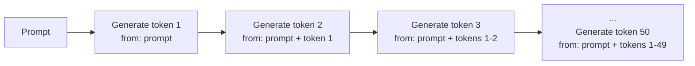
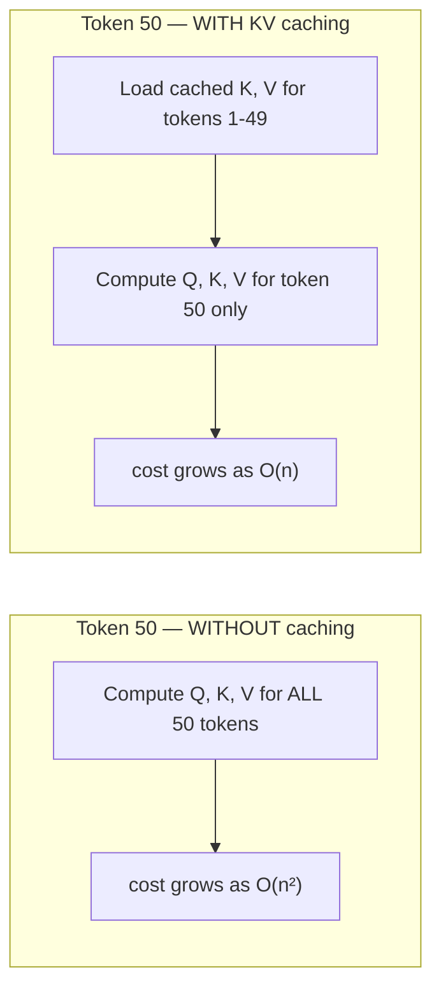
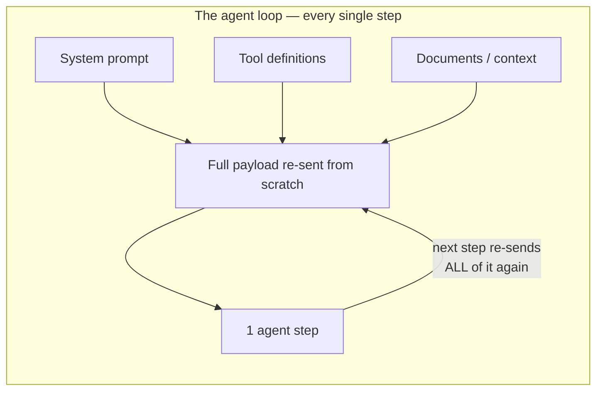
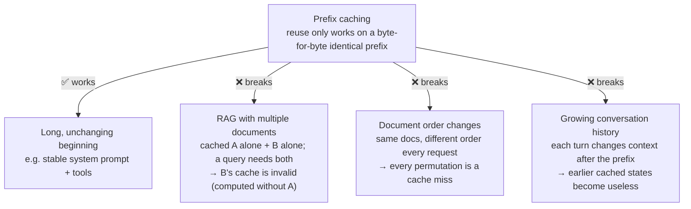
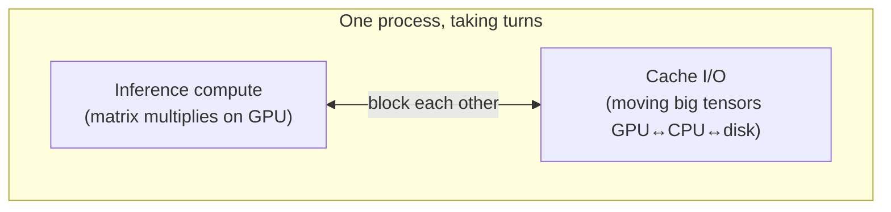
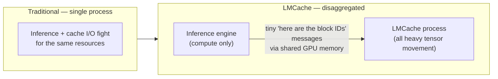
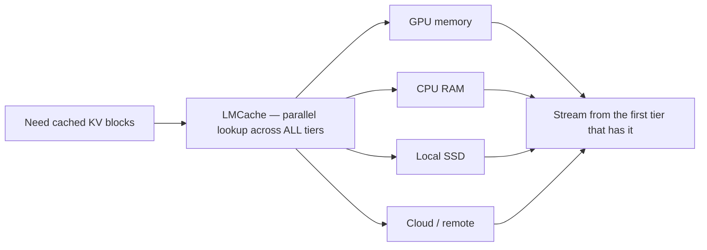
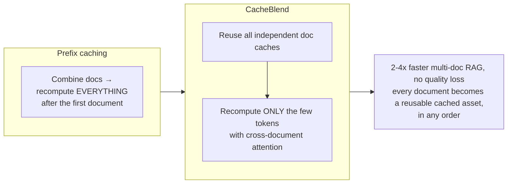

# Your KV Caching Is Broken

*A practitioner's guide to KV cache management — why redundant computation, not compute, is the real inference bottleneck, and how a modern caching architecture (LMCache + CacheBlend) cuts input-token costs by up to 90% and speeds up LLM inference by up to 14x.*

> A deep dive for the [AI Engineer course](../README.md) — this is stack item **#8 (deployment and MLOps)** taken to the frontier. Based on a thread and article by **Akshay Pachaar** ([@akshay_pachaar](https://x.com/akshay_pachaar/status/2074502882812952666)).

---

## The interview question that ends careers

You're in an ML Engineer interview at Anthropic. The interviewer asks:

> "Our model generates 100 tokens in 42 seconds. How do you make it 5x faster?"

You say: *"I'll optimize the model architecture and use a better GPU."*

**Interview over.**

Here's what you missed: **the real bottleneck isn't compute — it's redundant computation.** Without KV caching, your model recalculates the same attention keys and values for every single token it generates. That's how a 9-second inference balloons into 42 seconds: roughly **80% of the time is wasted on repeated calculations.**

---

## Why token generation is so wasteful

LLM token generation is **autoregressive** — each new token is generated from the prompt plus everything generated so far:



At each step you reprocess **all** previous tokens through attention. By token 50, you have computed attention for token 1 **fifty times.**

For each token, the transformer computes a **Query (Q)** from the current token, and a **Key (K)** and **Value (V)** from all previous tokens, then:

```
Attention(Q, K, V) = softmax(QKᵀ)V
```

The problem: **K and V for previous tokens never change.** You are recalculating identical matrices every single step.

---

## How KV caching fixes it

Instead of recomputing K and V every step, you **cache them** after the first computation and reuse them. You only compute K and V for the *new* token.



You've eliminated the quadratic redundancy.

**Two things fall out of this:**

- **The tradeoff is memory.** The KV cache is fast but it takes up a lot of memory. There is always a speed-vs-memory tension.
- **The first token is always slower.** Before generating anything, the model must compute the KV cache for the *entire prompt* (the "prefill"). That is exactly why ChatGPT takes longer to produce the first token than the rest — first token = building the KV cache for the whole prompt; remaining tokens = just load cached KVs + compute the new one.

---

Everything above is how KV caching works **inside a single request**. Running it **in production** is a different, harder problem — and it's where most practitioners haven't caught up.

## The production problem: you're paying to re-read the same notes

Researchers at Stanford studied how AI agents actually spend their inference budgets. The finding that stood out: **about 62% of what gets sent to an agent on every call is repeated content** — the same system prompts, the same tool definitions, the same documents, fed in again and again.



The expensive part isn't the thinking. **It's the AI re-reading the same notes over and over.**

Per-token prices dropped ~80% from 2023 to 2026 (GPT-4-class models fell from ~$30 to ~$0.40 per million tokens). But **agentic workflows consume 5–30x more tokens per task** than a chatbot query, because every step re-sends all that context. Volume outran the price cuts, so the total bill went **up**.

- **Uber** rolled out Claude Code across engineering and **burned their entire 2026 AI budget in four months.**
- **Gartner** forecasts **40% of AI agent projects will be cancelled by 2027** on cost overruns alone.

The industry is optimizing the wrong variable. Making tokens cheaper doesn't help if most of those tokens shouldn't exist.

---

## What prefix caching solves — and where it stops

The industry built **prefix caching** (a.k.a. prompt caching) to fight this. If two requests share the same opening tokens, the provider stores the KV cache from the first and reuses it on the second, skipping recomputation of the shared prefix.

The savings are real: **Anthropic's implementation gives a ~90% cost reduction on cached input tokens**, with 60–85% hit rates achievable for stable workloads. For teams with stable system prompts and tool definitions, it's the single highest-leverage optimization available today.

But it has a hard ceiling: **the cached region must be an exact, byte-for-byte prefix.** Change one character and you get a full cache miss. That breaks in three very common places:



Alibaba Cloud's production data confirms it: **10% of KV cache blocks serve 77% of all hits.** Most cached content never gets reused, because the rigid prefix rule prevents it.

---

## The caching performance tax

There's a second problem, and it affects **every** KV cache tool today: they all run **inside the inference engine's process.** Cache operations (storing/loading/moving KV tensors) and inference computation share the same resources — so they **can't run at the same time.**



When the engine manages cache, it stops doing inference. When it does inference, cache ops wait. *Think of a chef who has to run to the storage room between every dish.*

The impact is measurable: Google's **TurboQuant** compresses the cache to 3 bits/value with zero accuracy loss — but running it *inside* the inference engine causes a **20%+ inference slowdown**, negating the benefit. Cache management (I/O-heavy) and inference serving (compute-heavy) are fundamentally different workloads; forcing them into one process is like running a database and a web server in the same thread.

---

## LMCache: the disaggregated approach

**[LMCache](https://github.com/LMCache/LMCache)** is an open-source project that moves cache management **out of the inference engine into a completely separate process** running alongside it. *The chef never leaves the kitchen; a dedicated runner handles all fetching and storing independently.*



The engine just tells LMCache *"here are the block IDs I need"* (tiny messages, almost no data); all the heavy tensor movement happens in LMCache's own process. Three concrete wins:

- **No resource contention** — cache I/O never blocks inference and vice versa; the ~20% throughput loss disappears.
- **Zero-copy sharing across GPUs** — both GPUs read/write the same memory region directly, skipping the multiple memory copies the traditional setup needs.
- **Multi-tier parallel loading** — cached data can live across GPU memory, CPU RAM, local SSD, and remote storage. Instead of checking tiers one-by-one (bottlenecking on the slowest), LMCache checks **all of them at once** and streams from wherever it hits first.



**The numbers** (H200 GPUs, Qwen3-235B, 50 concurrent users, vs in-process caching):

| Metric | Result |
|---|---|
| Time-to-first-token | **14x faster** |
| Decoding | **4x faster** |
| Startup time | ~3 min → **~30 sec** |
| Break-even | reuse a cached prompt **~2–3×/week (≈1% hit rate)** and it pays for itself |
| At 10% hit rate, 1,000 nodes | **≈ $29M saved over 3 years** |

LMCache integrates with all major inference engines (**vLLM, SGLang, TensorRT-LLM**) on both NVIDIA and AMD GPUs.

---

## CacheBlend: fixing the prefix ceiling

LMCache solves the *performance* side. **CacheBlend** (the LMCache team's research paper, **EuroSys 2025 Best Paper Award**) fixes the *prefix* ceiling — the "cached document A and B separately, now a query needs both" problem.

The insight: in modern transformers, **most tokens primarily attend to their own local context.** Only a small fraction have strong connections across document boundaries. CacheBlend identifies just those few tokens and **selectively recomputes only them**, reusing everything else as-is.



For anyone building **RAG, multi-document Q&A, or agents that accumulate context from multiple sources**, this turns every document in the knowledge base into a reusable cached asset — regardless of order or what sits alongside it.

---

## Built for production

LMCache isn't a research prototype — it ships with what production teams expect:

- **Observability** — Prometheus and OpenTelemetry for cache-hit-rate and I/O tracking.
- **Deployment** — a Kubernetes operator.
- **Tooling** — a CLI for debugging and benchmarking.
- **Fault tolerance** — if the inference engine crashes, LMCache preserves cached data on CPU/storage so recovery isn't cold. If LMCache crashes, the engine enters a downgrade mode (caching off, inference continues) and reconnects automatically. Neither failure takes the whole system down.

---

## The bigger picture

AI applications now generate roughly **15 TB of KV cache per GPU per day**, and most of it gets thrown away. The infrastructure to manage, store, and reuse that data is being built right now.

For practitioners running agentic workloads on self-hosted models, **KV cache management isn't a future optimization — it's a cost-structure decision you're making today, whether you realize it or not.** LMCache is 100% open-source and at the forefront of it.

So the *real* answer to that interview question isn't "a better GPU." It's: *"I'd stop recomputing what I already computed — KV caching within the request, prefix caching across requests, and a disaggregated cache like LMCache with CacheBlend to make it hold up at production scale."*

That answer gets you the job.

---

<sub>Credit: [Akshay Pachaar (@akshay_pachaar)](https://x.com/akshay_pachaar/status/2074502882812952666) — original thread and article. Further reading: [LMCache](https://github.com/LMCache/LMCache) · CacheBlend (EuroSys 2025).</sub>
