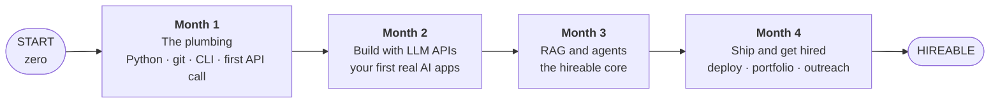
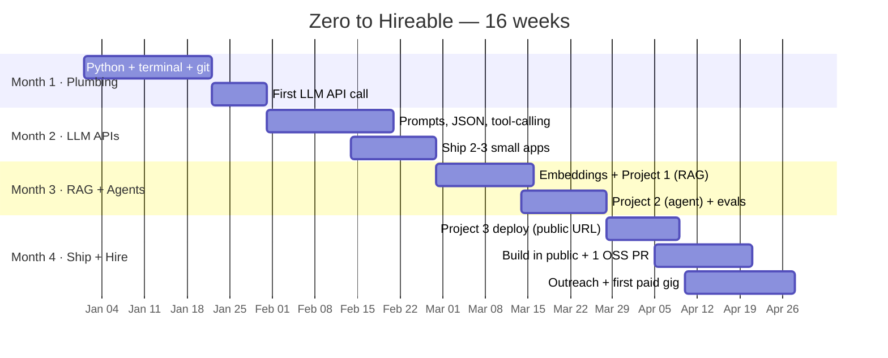

# Zero to Hireable AI Engineer in 4 Months

> **No degree. No math. The path in.**

*The operational companion to the [main course](../README.md): the same build-first philosophy, laid out as a concrete, month-by-month cadence you can actually follow. Four months, four rungs, one flag at the top — hireable. Inspired by the "Zero to AI engineer in 4 months" guide from [@free_ai_guides](https://x.com/free_ai_guides/status/2074531958600638877).*

---

## The map

Four rules make this timeline real, not a fantasy:

1. **Build 2 hours for every 1 hour you learn.** Watching is not progress.
2. **Everything ships public.** A private project does not exist for your career.
3. **Understand every line.** If an AI wrote it, you must be able to explain it.
4. **Done > perfect.** Ship the ugly version, improve it in public.

Roughly 2–3 focused hours a day gets you there. Skip days without guilt; just don't skip building.

---

## Month 1 — The plumbing

The unglamorous foundation everything else sits on. You are not learning AI yet; you are learning to *operate* like an engineer.

| Week | Focus | Build |
|---|---|---|
| 1 | **Python** — variables, functions, classes, `async`/`await`, reading code | A script that reads a file and prints stats about it |
| 2 | **The terminal + Linux basics** — navigating, pipes, env vars, `venv`/`uv` | Run your scripts from the command line, not an IDE button |
| 3 | **Git + GitHub** — commit, branch, push, PR | Put week 1–2's code on GitHub with a real README |
| 4 | **Your first LLM API call** — API keys, requests, parsing the response, errors, rate limits | A CLI tool that calls Claude/GPT to summarize any text file |

**You're done when:** you can call an LLM programmatically, handle its response, and push the code to GitHub from the terminal. That's the whole gate — most people never even get here.

> Async matters specifically because AI work is mostly *waiting on API calls*. Blocking code bottlenecks everything you'll build later.

---

## Month 2 — Build with LLM APIs

Now you build *with* the model. This is where "AI engineering" actually starts: a product is fundamentally a series of well-structured API calls.

| Week | Focus | Build |
|---|---|---|
| 1 | **Prompt structure + handling responses** — system vs user, temperature, streaming | A tool that rewrites text in a chosen tone |
| 2 | **Structured output** — asking for JSON, validating it, retrying on bad output | A classifier that returns clean, typed JSON |
| 3 | **Tool / function calling** — let the model call your functions | A model that can call a calculator or a weather function |
| 4 | **Polish + ship** — error handling, a tiny CLI or web UI, a README each | Package 2–3 of the above into real repos |

**You're done when:** you've shipped **2–3 small LLM apps** to GitHub, each with a README that explains what it does and how to run it. Write one short post about the hardest bug you hit.

---

## Month 3 — RAG and agents (the hireable core)

This is the month that gets you hired. Everything before was setup. **Do not rush it.**

| Week | Focus | Build |
|---|---|---|
| 1 | **Embeddings + vector search** — turning text into vectors, similarity, chunking | Embed a folder of docs; search them by meaning, not keywords |
| 2 | **RAG end-to-end** — ingest → embed → store → retrieve → answer, grounded, no hallucination | **Project 1: a RAG app over your own data** (notes, PDFs, docs) |
| 3 | **Agents + tool use** — planning, multi-step execution, handling a tool that fails | **Project 2: an agent that uses ≥2 real tools** |
| 4 | **Harden + explain** — edge cases, evals (did a change help or hurt?), a walkthrough | Make both projects reliable; be able to explain every line |

**You're done when:** Project 1 and Project 2 both work, are public, and you can explain any line in an interview. These two projects are the single most in-demand thing in applied AI right now.

> Want to see how deep this goes? Study a self-improving agentic RAG system and a production agent-memory design — both linked in the [main course → Go Deeper](../README.md#go-deeper-real-systems-worth-studying).

---

## Month 4 — Ship and get hired

A project on your laptop is a hobby. This month you make it real and make it *seen*.

| Week | Focus | Build |
|---|---|---|
| 1 | **Deploy** — get a project running somewhere with a public URL; basic monitoring | **Project 3: deploy one of your apps** a stranger can visit |
| 2 | **Build in public** — write a thread per project: what, the hard part, the fix | 3 public posts + a clean portfolio/GitHub profile |
| 3 | **Contribute + reach out** — one open-source PR; proof-first cold outreach | 1 merged PR + 5 "here's a demo that solves your problem" emails |
| 4 | **Freelance + specialize** — take one tiny paid gig; pick your lane (RAG / agents / product) | First paid project; 5 more outreach conversations |

**You're done when:** a stranger can use your deployed app, your name has a public trail, and you're in active conversations with people who might hire you. That is what "hireable" means — not a certificate, a **trail of proof.**

---

## The 16-week view

---

## Why 4 months is enough

You are not trying to learn *all* of computer science. You are learning the specific, practical slice that turns an existing model into a working product — and proving you can do it. The degree was always a *proxy* for "can this person do the work." A deployed RAG app and a working agent aren't a proxy; they **are** the work, made visible.

Four months of building beats four years of preparing to build. Start Month 1, Week 1, today.

> **START → ▪▪▪▪ → 🚩 HIREABLE**

---

Companion to the [AI Engineer course](../README.md). Concept credit: [@free_ai_guides](https://x.com/free_ai_guides/status/2074531958600638877) — "Zero to AI engineer in 4 months. No degree. No math."
